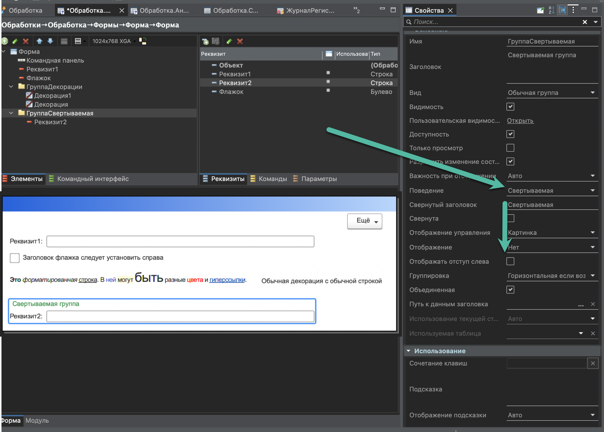

[](https://openyellow.notion.site/openyellow/24727888daa641af95514b46bee4d6f2?p=27e2878921a84be3805410324117c660&amp;pm=s)

# Гайд для создания форм на 1С

***Гайд в процессе работы, все может тысячу раз поменяться***

**Идея:**

1. Создать гайд по интерфейсу для приложения 1С
2. В гайде планирую показать основные элементы, рассказать когда и как их использовать
3. Стоит подготовить примеры и антипримеры форм

**Что уже есть:**

1. [Стандарты по оформлению форм](https://its.1c.ru/db/v8std#browse:13:-1:11)
2. [Maker](https://1cmaker.com/)
3. [Хитрости и советы по созданию форм](https://rarus.ru/publications/20220530-ot-ekspertov-hitrosti-po-sozdaniyu-form-1c-532555/)
4. [Контур.Гайды](https://guides.kontur.ru/)
5. Алан Купер об интерфейсе. Основы проектирования взаимодействия

Возможно, что-то есть еще, но быстрым поиском не нашел

**Дизайн:**

- [Гайд для создания форм на 1С](#гайд-для-создания-форм-на-1с)
  - [Элементы формы](#элементы-формы)
    - [Декорация](#декорация)
    - [Группы](#группы)
      - [Обычная группа](#обычная-группа)
      - [Свертываемая группа](#свертываемая-группа)
      - [Всплывающая группа](#всплывающая-группа)
    - [Флажок](#флажок)
    - [Поле ввода](#поле-ввода)
    - [Гиперссылки](#гиперссылки)
    - [Переключатель](#переключатель)
    - [Тумблер](#тумблер)
    - [Кнопка](#кнопка)
    - [Табличная часть](#табличная-часть)
    - [Диалоговое окно](#диалоговое-окно)
    - [Подсказка и расширенная подсказка](#подсказка-и-расширенная-подсказка)
  - [Компоновка формы](#компоновка-формы)
    - [Командная панель](#командная-панель)
    - [Команды формы](#команды-формы)
    - [Шапка формы](#шапка-формы)
    - [Подвал формы](#подвал-формы)
    - [Сохранение размера формы](#сохранение-размера-формы)

## Элементы формы

### Декорация

Самый простой элемент дизайна форм. Можно вывести любой текст


1. Декорация-надпись:

- Может использоваться как заголовок у сложных полей.
- Может использоваться как подсказка на форме. В этом случае часто используют Форматированную строку, чтобы добавить гиперссылки и оформление.

    

2. Декорация-картинка

- Картинка может использовать для иллюстрации или чтобы обратить внимание пользователя
- Картинка может быть и в составе форматированной строки, и отдельным элементом.

    

3. Не следует использовать [Декорацию](#декорация) для установки заголовки простых полей.
    В этом случае не срабатывает автофокус на поле и часто забывают поставить двоеточие в заголовке поля.

4. Не следует использовать [Декорацию](#декорация) для выравнивания элементов. Лучше использовать для этого свойства [Групп](#группы).


[⬆️ Наверх](#гайд-для-создания-форм-на-1с)

### Группы

Группы используются для объединения элементов вместе. Группы позволяют управлять расположением и выводом элементов

#### Обычная группа

1. В большинстве случае не следует отображать заголовок у группы
2. Не следует в заголовке группы писать слово "Группа" (по умолчанию платформа его добавляет - следует убрать)
3. Не следует оставлять бессмысленные подсказки в группе, так как они выводится при удержании курсора над группой (по умолчанию платформа добавляет - следует убрать)
4. Лучше избегать Расположение - Горизонтально, если возможно. Исходить следует из минимально допустимого расширения 1280х768 px
5. Типы выделения обычной группы. Сильное выделение - добавляется полоса и отступ у подчиненных реквизитов, Обычное выделение и Слабое выделение - крупный заголовок.

   

6. Обычное выделение имеет больший отступ вокруг себя. [Подробнее о слабом и обычном отображении групп](https://t.me/Aripovn/31)

   

7. Для выравнивая элементов в подчиненных группах следует использовать свойство - **Сквозное выравнивание**. Это свойство позволяет выравнять элементы, которые находятся в подчиненных группах.

    <details><summary>Как выглядит В ЕДТ</summary>
        
    </details>

8. Для прижатия элементов к одному из краев следует использовать свойство - **Выравнивание элементов и заголовков**

    <details><summary>Как выглядит В ЕДТ</summary>
        
    </details>

#### Свертываемая группа

Свертываемая группа позволяет скрыть реквизиты внутри сворачиваемого блока

  

1. Свертываемая группа используется, чтобы скрыть элементы - это делаем форму компактнее и удобнее для работы.
Также смотри стандарт - [Оформление групп разделов с настройками и справочниками](https://its.1c.ru/db/v8std/content/753/hdoc)

2. В заголовке свертываемой группы с реквизитами следует давать описание содержашихся значений, например, см. Банковский счет и Адрес:

    

   В случае если в группе находятся только команды или гиперссылки (см. пример в Администрирование в БСП), то заголовок свернутой группы необязательно формировать. В этом случае мы упрощаем навигацию по форме для пользователя.

3. У свертываемой группы с реквизитами следует снять флаг "Отображать отступ слева", чтобы элементы была вровень с остальными реквизитами формы.

    <details><summary>Как выглядит В ЕДТ</summary>
        
    </details>

4. Лайфхак для программного управлением свойства группы Свернута. Управлять этим свойством программно нельзя, но можно создать две группы с одинаковыми реквизитами, одна по умолчанию свернута, а другая по умолчанию развернута. ПриСозданииНаСервере следует проверить какую группу показать пользователю.

5. Не следует помещать в свертываемую группу элементы, которые требуются часто или являются обязательными.

6. Не следует размещать свертываемую группы выше обычных групп.

#### Всплывающая группа

Всплывающая группа может использоваться для размещения необязательных или справочных реквизитов, чтобы форма была компактнее


1. Следует понимать, что для пользователя такая группа не является привычным элементом и он может пропустить ее. Поэтому следует использовать элемент с осторожностью.
2. В случае если реквизиты заполнены, то следует давать описание содержащихся значений в заголовке группы, чтобы пользователь мог посмотреть их не открывая
3. У группы следует установить Отображение управления = Картинка, чтобы появилась соответствующая пиктограмма. Это позволит пользователю узнавать поведение таких элементов.
4. Всплывающую группу можно использовать как группу с подсказкой, на которой можно разместить не только форматированную строку, но и дополнительные реквизиты. Важно в этом случае сделать говорящий заголовок, побуждающий пользователя на него нажать.
5. Не следует помещать во всплывающую группу обязательные реквизиты, а также реквизиты, которые часто используются
6. Не следует экономить на заголовке у всплывающих групп. Пользователь должен понимать что ожидать при нажатии на заголовок.


[⬆️ Наверх](#гайд-для-создания-форм-на-1с)

### Флажок

Флажок используем для включения или выключения какой-либо опции.

1. У флажка заголовок устанавливаем справа. Здесь следует отойти от умолчания платформы.

    <details><summary>Как выглядит В ЕДТ</summary>
        
    </details>

2. Обычно влияние на остальные реквизиты у флажка небольшая. Например, включение флажка разблокирует соседнюю гиперссылку. В случае если нужно влиять на форму сильнее, то лучше рассмотреть [Переключатель.](#переключатель)
3. Флажок лучше использовать для простой опции, в которой понятно что означает включенный и выключенный флажок. Для сложной опции с непонятным поведением при включенном и выключенном флажке лучше использовать [Переключатель.](#переключатель)


[⬆️ Наверх](#гайд-для-создания-форм-на-1с)

### Поле ввода

1. Если в поле ввода предусмотрено удаление или пустое значение, то нужно добавить кнопку Очистки (x).
2. Для строковых полей ввода иногда следует предусмотреть кнопку выбора, например, выбор Пути к файлу или например выбор Наименования.
3. Не всегда нужно использовать заголовок поля ввода. Например, в шапке отчета мы не пишем у поля Организация заголовок, так как правило пользователи знают свою организацию и по значению могут понять что в этом поле указывает.

<details><summary>Как выглядит В ЕДТ</summary>


</details>

В случае если заголовок не указываем, то обязательно должна быть подсказка ввода.

<details><summary>Как выглядит В ЕДТ</summary>


</details>

То есть для Организаций в отчете следует писать: По всем организациям. Таким образом, показываем, что сейчас символизирует собой этой поле.


[⬆️ Наверх](#гайд-для-создания-форм-на-1с)

### Гиперссылки

Гиперссылка используется для перехода к другой форме

1. Открытие подчиненных и служебных форм. Например, настройка НДС.


2. Гиперссылка должна иметь осмысленное название и достаточно длинным, чтобы в нее можно было нажать.
3. С помощью гиперссылки не следует выполнять действия на форме. Для этого следует использовать [Кнопки](#кнопка)
4. Не следует менять цвет гиперссылки.


[⬆️ Наверх](#гайд-для-создания-форм-на-1с)

### Переключатель

Переключатель должен действовать на то, что находится под ним. Не следует менять что-то по переключателю, что находится над ним. Так как на форму мы смотрим сверху-вниз.


[⬆️ Наверх](#гайд-для-создания-форм-на-1с)

### Тумблер

Тумблер выглядит как кнопки, поэтому лучше использовать его, если от значения перестраивается форма под ним. То есть как будто выполняется какое-то действие.
Тумблер лучше использовать для 3 или больше элементов, так как когда их 2 - не ясно какой из них нажат.


[⬆️ Наверх](#гайд-для-создания-форм-на-1с)

### Кнопка

1. Кнопка должна выполнять какое-то действие.
2. Допускается использовать кнопку Без фигуры для команд, которые не рекомендуется выполнять или когда кнопок слишком много.
Подробнее про [отображение кнопок без фигур](https://t.me/AriN1C/46)


[⬆️ Наверх](#гайд-для-создания-форм-на-1с)

### Табличная часть

1. В табличной части должен быть заголовок в 1 строку. При необходимости вывести сложный заголовок следует рассмотреть возможность выводить эти значения в самой таблице. Например, см. Корректировка реализации
2. В случае если табличная часть из одной колонки, то шапка не нужна. В этом случае лучше описать декорацией содержание табличной части, если это требуется.
3. В табличной части последней колонкой должна идти пустая колонка, чтобы проще было управлять шириной табличной части. У этой колонки следут отключить заголовок, включить флаг "Только просмотр" и установить "Растягивать по горизонтали".
4. Заголовок колонки табличной части следует прижимать к значению, например, для Числа следует прижимать вправо, а для Строка или Ссылка оставлять по умолчанию слева.

Еще некоторые пункты оформления описаны в стандарте для проектирования интерфейсов - <https://its.1c.ru/db/v8std/content/717/hdoc>


[⬆️ Наверх](#гайд-для-создания-форм-на-1с)

### Диалоговое окно

Диалоговое окно открывается для вопроса или предупреждения пользователю. Это блокирующее сообщение, которое требует обязательного внимания пользователя.
Обычно выводится для необратимых действий, например, очистка табличной части или установка особого режима работы.


1. Стоит уделить особое внимание тексту в диалоговом окне. Из текста должно быть понятно, что требуется от пользователя. Должен быть четкий вопрос с однозначным ответом.
2. Утвердительная кнопка должна однозначно говорить о том, что будет выполнено. В идеале должна повторять действие, которое запрашивается у пользователя.
3. Кнопка закрытия диалогового окна (крестик справа вверху) должене обрабатываться. Для этого одна из команд диалогового окна должна быть Отмена. Для этого стоит добавить свои кнопки диалогового окна.

    ```BSL
    &НаКлиенте 
    Асинх Процедура ЗадатьВопрос()
  
    ТекстВопроса = 
        "Для отключения уведомлений и комфортной работы рекомендуем использовать режим тишины.
        |В этом режиме будут приходить только важные уведомления
        |
        |Установить режим тишины?";
  
    Кнопки = Новый СписокЗначений;
    Кнопки.Добавить(КодВозвратаДиалога.Да, "Установить режим тишины");
    Кнопки.Добавить(КодВозвратаДиалога.Отмена, "Нет, оставить как есть");
  
    Результат = Ждать ВопросАсинх(ТекстВопроса, Кнопки);
  
    Если Результат = КодВозвратаДиалога.Да Тогда
        Сообщить("Режим тишины установлен");
    КонецЕсли;
  
    КонецПроцедуры
    ```


[⬆️ Наверх](#гайд-для-создания-форм-на-1с)

### Подсказка и расширенная подсказка

У большинства элементов есть свойство Подсказка, которая выводится в зависимости от свойства Отображение подсказки.
Подсказка - это обычная строка, но можно включить Расширенную подсказку, чтобы использовать форматированную строку. Для этого на элементе формы следует нажать на правую кнопку мыши и выбрать пункт Показать расширенную подсказку.

1. Для разовых подсказок хорошо подходит отображение через кнопку. Например, если пользователь видит новый ему элемент и сомневается, что с ним делать. В этом случае ему достаточно один раз посмотреть подсказку по кнопке, чтобы понять, что делать. Позже он сможет вернуться к этой подсказке, если потребуется.
    
    

2. Если форма используется не часто, то лучше расположить подсказку сверху, чтобы у пользователя она всегда была перед глазами. Например, если это форма с настройками каких-то правил. В этом случае пользователь при открытии формы сразу видит, что нужно сделать.

    

3. Подсказок много не бывает

[⬆️ Наверх](#гайд-для-создания-форм-на-1с)

## Компоновка формы

### Командная панель

Командную панель можно собрать самостоятельно если требуется добавить свои команды

1. Для стандартных команд формы у группы следует устанавить Источник команд - Форма
2. Для глобальных команд (структура подчиненности, дополнительные сведения и история изменений) у группы следует установить Источник команд - Глобальные команды командной панели формы


[⬆️ Наверх](#гайд-для-создания-форм-на-1с)

### Команды формы

1. В формах на весь экран основная кнопка обычно располагается слева вверху, например, **Провести и закрыть**.

    

2. В формах (модальных) не на весь экран основная кнопка располагается справа внизу, Например, **ОК**.

    

3. На форме должна быть одна кнопка по умолчанию. В случае если требуется сделать несколько, например, если действия важные и равнозначные, то этим командам следует установить оформление как у кнопки по умолчанию: шрифт - Жирный и цвет фона кнопки - Золотой RGB(255, 255, 0)

4. Если на форме несколько страниц, то кнопку по умолчанию следует переназначать при переключении страниц.


[⬆️ Наверх](#гайд-для-создания-форм-на-1с)

### Шапка формы

Элементы располагаем сверху вниз, слева направо в порядке важности.

1. Поля, которые нужно редко менять располагаем справа:
Например, поле Организация или Подразделение как правило заполняется значениями по умолчанию и не требуют внимания пользователя, поэтому располагаем их справа.
Для таких полей обязательно проверить, что они заполняются автоматически или сохраняются предыдущие значения.

2. Не следует стремится сделать левую и правую часть симметричной. Гораздо важнее чтобы слева были важные поля, а справа неважные. Вполне вероятно, что с правой стороны будет больше полей, чем с левой.

3. Некоторые поля могут скрываться по Функциональным опциями, например, Организация или Подразделение

4. Важно, не допустить ситуации, что поля ниже влияют на поля находящиеся выше. Например, не следует размещать сначала Договор, а потом Контрагента. Иначе пользователь может изменить это поле и не обратит внимание на то, что поменялось выше.

5. Не следует размещать поля, которые изменяют форму ниже других реквизитов. То есть условный **Вид операции** должен идти самым первым полем.


[⬆️ Наверх](#гайд-для-создания-форм-на-1с)

### Подвал формы

В подвале располагается наименее важные реквизиты. Также там может быть справочная информация в виде итогов.
В Бухгалтерии предприятия последними реквизитами обычно идут Комментарий и Ответственный.


[⬆️ Наверх](#гайд-для-создания-форм-на-1с)

### Сохранение размера формы

Для сохранения размера и положения окна следует испольпользовать свойство **КлючСохраненияПоложенияОкна**
Возможно, не актуально в платформе 8.3.23 и старше (TODO - проверить)

Подробнее про [управление размером формы](https://t.me/AriN1C/45)

```BSL
&НаКлиентеНаСервереБезКонтекста 
Процедура УправлениеФормой(Форма, Шаг) 
  
 Элементы = Форма.Элементы; 
  
 Если Шаг = 1 Тогда  
   
  Элементы.ГруппаСтраницы.ТекущаяСтраница = Элементы.СтраницаВход; 
  Элементы.СтраницаВход.Видимость = Истина; 
  Элементы.СтраницаРеквизиты.Видимость = Ложь;
                Элементы.СтраницаУспешно.Видимость = Ложь; 
   
 ИначеЕсли Шаг = 2 Тогда 
   
  Элементы.ГруппаСтраницы.ТекущаяСтраница = Элементы.СтраницаРеквизиты; 
  Элементы.СтраницаВход.Видимость = Ложь; 
  Элементы.СтраницаРеквизиты.Видимость = Истина;
                Элементы.СтраницаУспешно.Видимость = Ложь; 
 Иначе 
   
  Элементы.ГруппаСтраницы.ТекущаяСтраница = Элементы.СтраницаУспешно; 
  Элементы.СтраницаВход.Видимость = Ложь; 
  Элементы.СтраницаРеквизиты.Видимость = Ложь;
                Элементы.СтраницаУспешно.Видимость = Истина; 
 
 КонецЕсли; 
 
 Форма.КлючСохраненияПоложенияОкна = СтрШаблон("СостояниеФормыШаг%", Шаг); 
  
КонецПроцедуры
```


[⬆️ Наверх](#гайд-для-создания-форм-на-1с)
