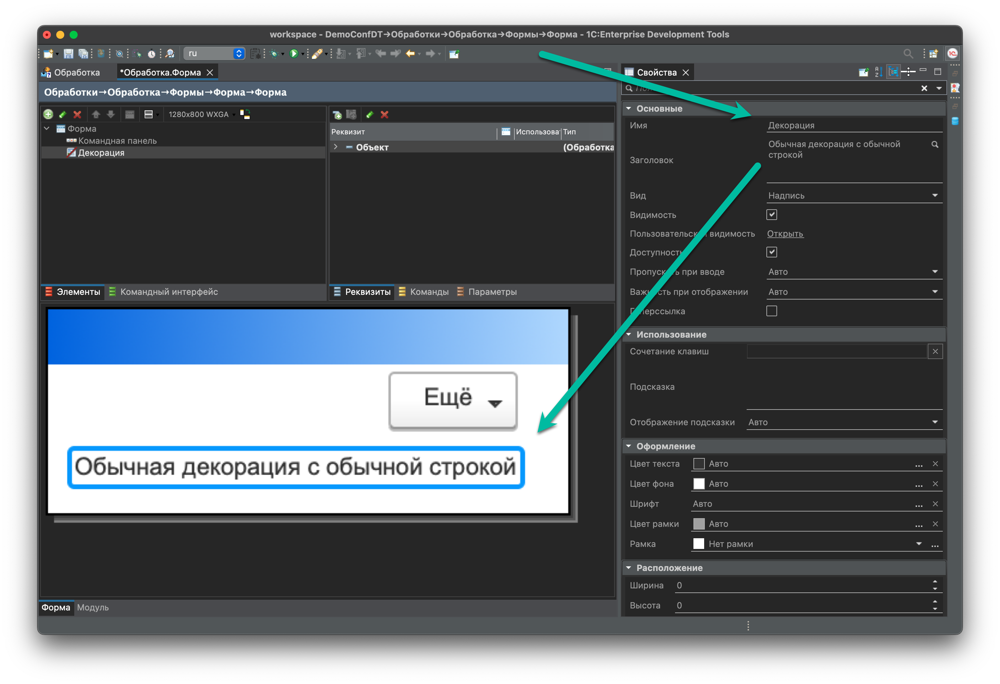
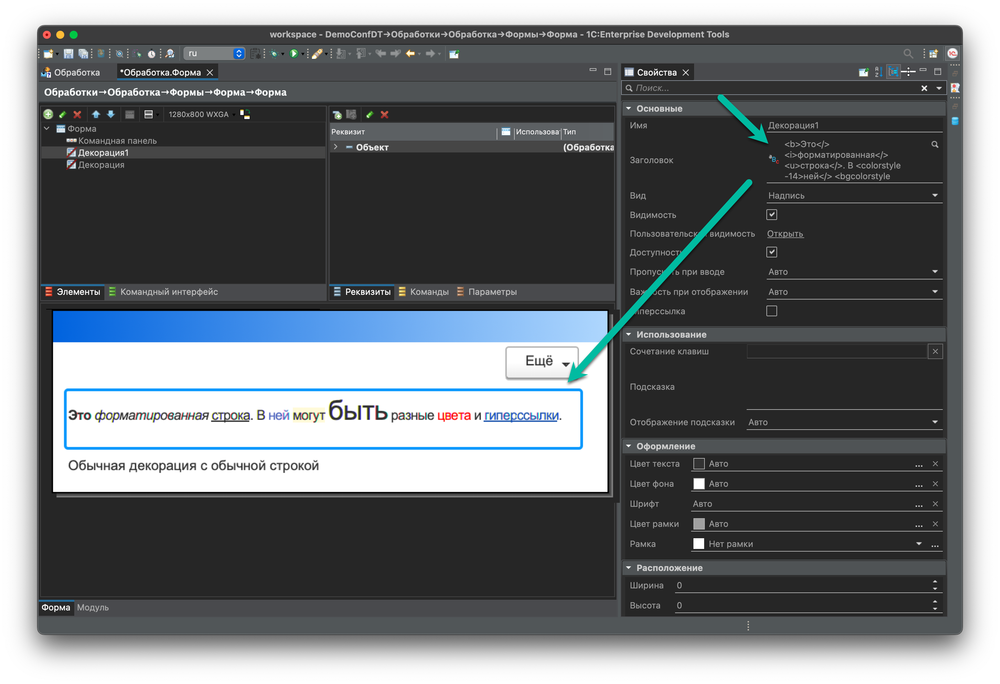
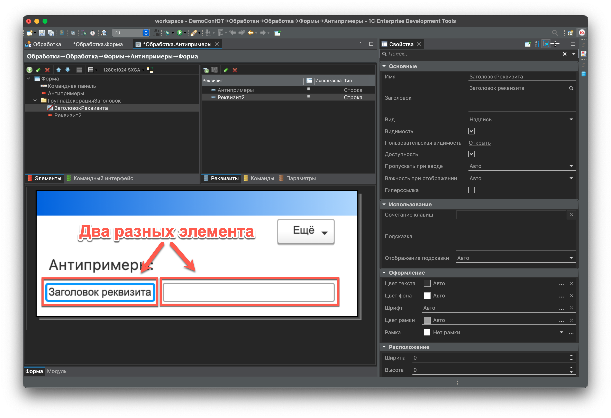
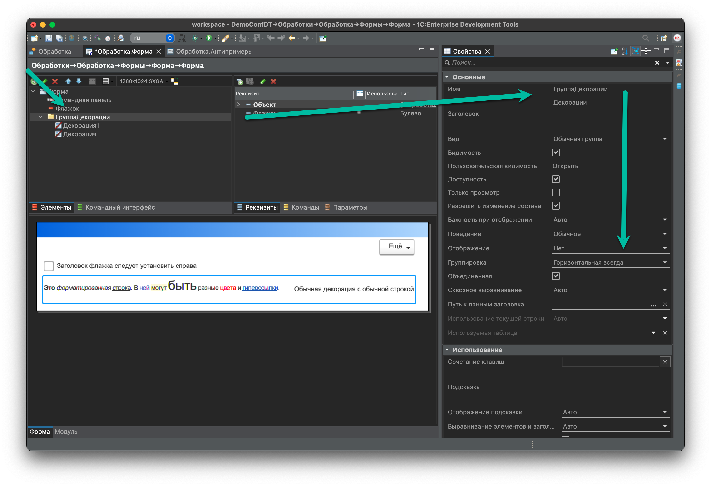
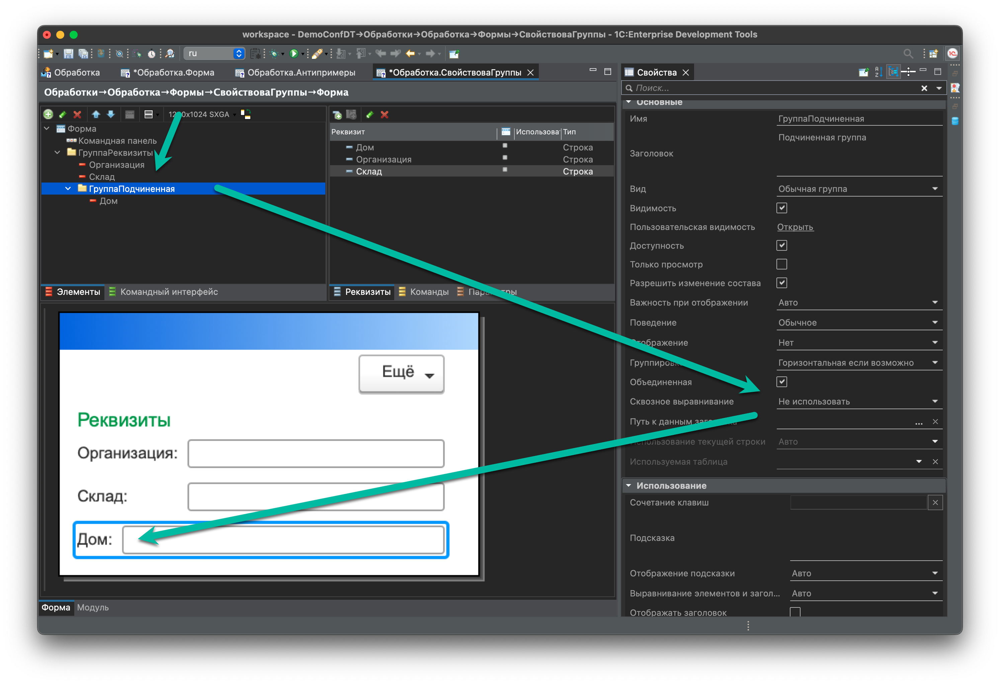
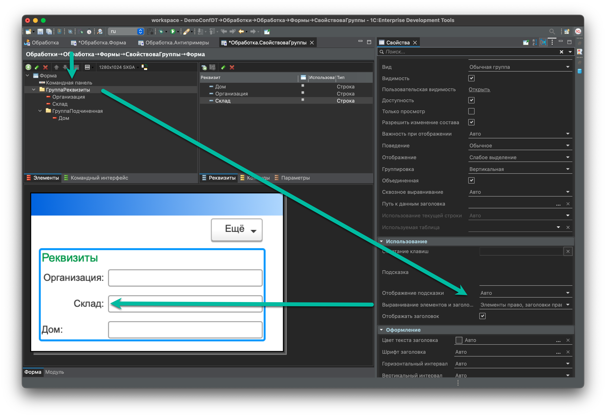
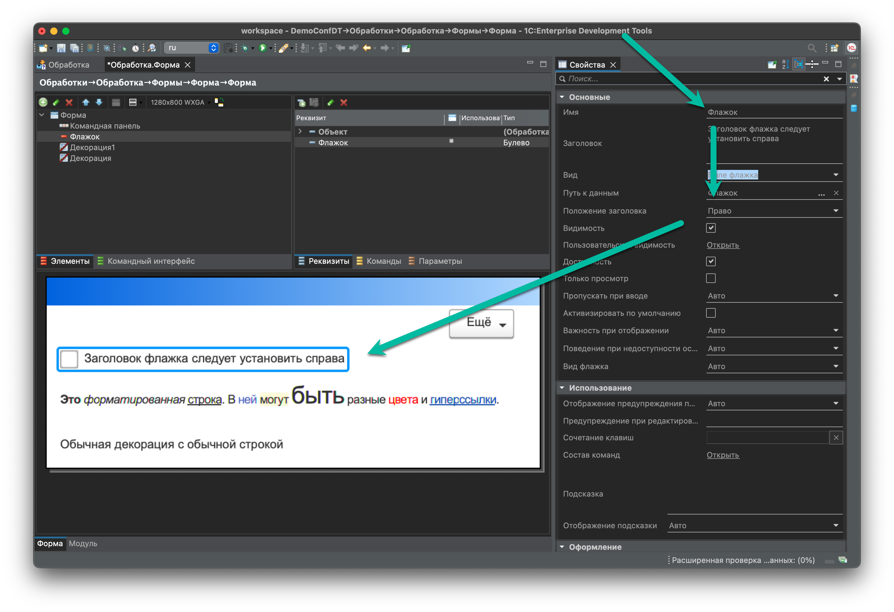
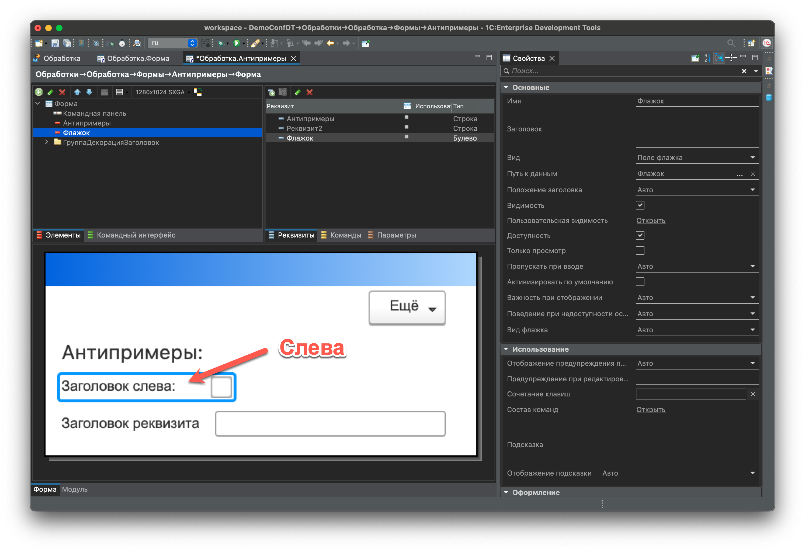
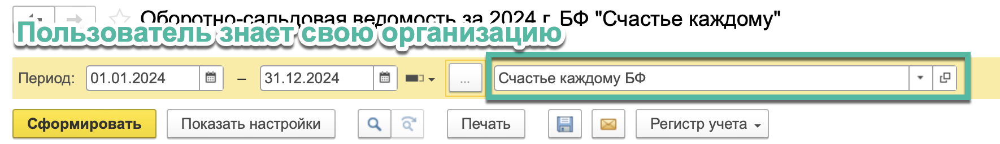
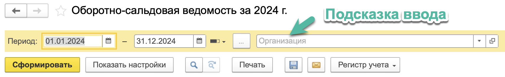

# Гайд для создания форм на 1С

**Идея:**

1. Создать гайд по интерфейсу для приложения 1С
2. В гайде планирую показать основные элементы и когда и как их использовать
3. Стоит подготовить примеры и антипримеры форм

**Что уже есть:**

1. Стандарты по оформлению форм - <https://its.1c.ru/db/v8std#browse:13:-1:11>
2. Maker - <https://1cmaker.com/>
3. Хитрости и советы по созданию форм - <https://rarus.ru/publications/20220530-ot-ekspertov-hitrosti-po-sozdaniyu-form-1c-532555/>
4. Контур.Гайды - <https://guides.kontur.ru/>
5. Алан Купер об интерфейсе. Основы проектирования взаимодействия

Возможно, что-то есть еще, но я быстрым поиском не нашел.

- [Гайд для создания форм на 1С](#гайд-для-создания-форм-на-1с)
  - [Элементы формы](#элементы-формы)
    - [Декорация](#декорация)
    - [Группы](#группы)
      - [Обычная группа](#обычная-группа)
      - [Свертываемая группа](#свертываемая-группа)
      - [Всплывающая группа](#всплывающая-группа)
    - [Флажок](#флажок)
    - [Поле ввода](#поле-ввода)
    - [Гиперссылки](#гиперссылки)
    - [Переключатель](#переключатель)
    - [Тумблер](#тумблер)
    - [Кнопка](#кнопка)
    - [Табличная часть](#табличная-часть)
    - [Диалоговое окно](#диалоговое-окно)
  - [Компоновка формы](#компоновка-формы)
    - [Командная панель](#командная-панель)
    - [Команды формы](#команды-формы)
    - [Шапка формы](#шапка-формы)
    - [Подвал формы](#подвал-формы)

## Элементы формы

### Декорация

Самый простой элемент дизайна форм. Можно указать для него простой текст.

**Использование:**

1. Декорация-надпись:

Может использоваться как заголовок у сложных полей.
Может использоваться как подсказка на форме. Обычно в этом случае используют Форматированную строку, чтобы добавить гиперссылки

2. Декорация-картинка

Картинка может быть и в составе форматированной строки и отдельным элементом.

**Неправильное использование:**

1. Не следует использовать [Декорацию](#декорация) для установки заголовки простых полей.

  В этом случае не срабатывает автофокус на поле и часто забывают поставить двоеточие в заголовке поля.
  

2. Не следует использовать [Декорацию](#декорация) для выравнивания элементов. Лучше использовать для этого свойства [Групп](#группы).

### Группы

Группы используются для объединения элементов вместе. Группы позволяют управлять расположением элементов.

#### Обычная группа

1. В большинстве случае не используется заголовок у группы
2. Не следует в заголовке группы писать слово Группа (по умолчанию платформа его добавляет - следует убрать)
3. Не следует оставлять бессмысленные подсказки в группе, так как они выводится при удержании курсора над группой
4. Лучше избегать Расположение - Горизонтально, если возможно. Исходить следует из минимально допустимого расширения 1280х768 px

**Использование:**

1. Для выравнивая элементов в подчиненных группах следует использовать свойство - **Сквозное выравнивание**. Это свойство позволяет выравнять элементы, которые находятся в подчиненных группах.

2. Для прижатия элементов к одному из краев следует использовать свойство - **Выравнивание элементов и заголовков**

#### Свертываемая группа

1. Свертываемая используется, чтобы скрыть элементы, которые сейчас не обязательно отображать. Например, мы уже заполнили сведения о банковском счете и показывать все поля необязательно.
2. Рекомендуется в заголовке свертываемой группы давать описание содержашихся значений, например:
// TODO
3. Не следует помещать в свертываемую группу элементы, которые требуются часто
4. Также смотри стандарт - [Оформление групп разделов с настройками и справочниками](https://its.1c.ru/db/v8std/content/753/hdoc)

#### Всплывающая группа

Обычно используется как подсказка на форме, в которой можно расположить несколько элементов, а не только форматированную строку.

### Флажок

**Использование:**

- Флажок используем для включения или выключения какой-либо опции.
- Обычно зона действия флажка небольшая и находится непосредственно рядом с самим флажком.
- У флажка заголовок устанавливаем справа. Здесь следует отойти от умолчания платформы

**Неправильное использование:**

1. Не следует использовать заголовок слева, так как это непривычно для пользователя. Здесь следует отойти от умолчания платформы.

### Поле ввода

1. Если в поле ввода предусмотрено удаление или пустое значение, то нужно добавить кнопку Очистки (x).
2. Для строковых полей ввода иногда тоже следует предусмотреть кнопку выбора, например, выбор Пути к файлу или например выбор Наименования.
3. Не всегда нужно использовать заголовок поля ввода. Например, в шапке отчета мы не пишем у поля Организация заголовок, так как правило пользователи знают свою организацию и по значению могут понять что в этом поле указывает.

В случае если заголовок не указываем, то обязательно должна быть подсказка ввода.

То есть для Организаций в отчете следует писать: По всем организациям. Таким образом, показываем, что сейчас символизирует собой этой поле.

### Гиперссылки

Гиперссылка должна куда-то вести. То есть этот элемент уводит фокус с экрана на какую-то новую форму. Иногда вместо Кнопок лучше использовать Гиперссылки, чтобы уводить куда-то пользователя.
Не стоит менять цвет гиперссылки.

### Переключатель

Переключатель должен действовать на то, что находится под ним. Не следует менять что-то по переключателю, что находится над ним. Так как на форму мы смотрим сверху-вниз

### Тумблер

Тумблер выглядит как кнопки, поэтому лучше использовать его именно таким образом.
Тумблер лучше использовать для 3 или больше элементов, так как когда их 2 - не ясно какой из них нажат.

### Кнопка

1. Кнопка должна выполнять какое-то действие.
2. Допускается использовать кнопку Без фигуры для команд, которые не рекомендуется выполнять или когда кнопок слишком много.

### Табличная часть

1. В табличной части должен быть заголовок в 1 строку. При необходимости вывести сложный заголовок следует рассмотреть возможность выводить эти значения в самой таблице. Например, см. Корректировка реализации
2. В табличной части последней колонкой должна идти пустая колонка, чтобы проще было управлять шириной табличной части.
3. Заголовок колонки табличной части следует прижимать к значению, например, для Числа следует прижимать вправо, а для строки оставлять по умолчанию слева.

### Диалоговое окно

1. Кнопка по крестику должно тоже обрабатываться в результате. Обычно рекомендуется создать свои команды для этого окна, чтобы одна из них была Закрыть.
TODO - привести пример кода и формы.

## Компоновка формы

### Командная панель

Командную панель можно собрать самостоятельно если требуется добавить свои команды

### Команды формы

1. В модальных формах не на весь экран основная кнопка располагается справа внизу, Например, ОК.
2. В формах на весь экран основная кнопка обычно располагается слева вверху, например, Провести.

### Шапка формы

Элементы располагаем сверху вниз, слева направо.

1. Поля, которые нужно редко менять располагаем справа:
Например, поле Организация или Подразделение как правило заполняется значениями по умолчанию и не требуют внимания пользователя, поэтому располагаем их справа.
Для таких полей обязательно проверить, что они заполняются автоматически или сохраняются предыдущие значения. 

2. Не следует стремится сделать левую и правую часть симметричной. Гораздо важнее чтобы слева были важные поля, а справа неважные. Вполне вероятно, что с правой стороны будет больше полей, чем с левой. 

3. Необязательные поля могут скрываться по Функциональным опциям, например, Организация или Подразделение

### Подвал формы

В подвале располагается наименее важныя реквизиты. Также там может быть справочная информация в виде итогов.
В Бухгалтерии предприятия последними реквизитами обычно идут Комментарий и Ответственный.

